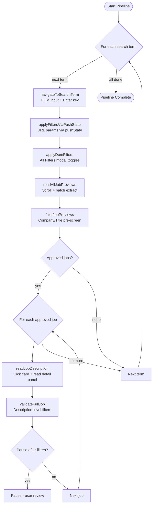
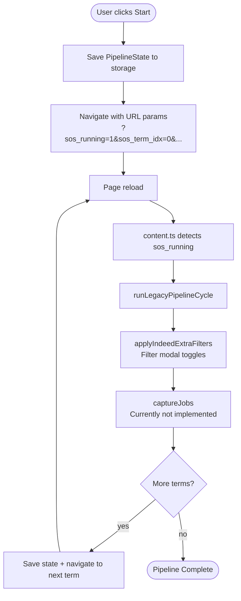
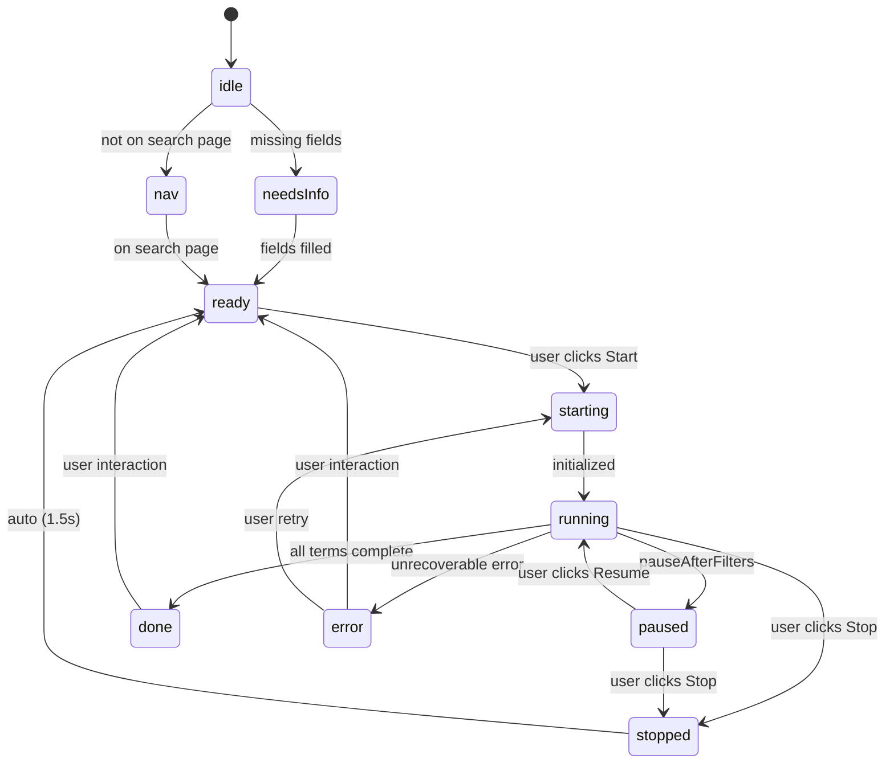
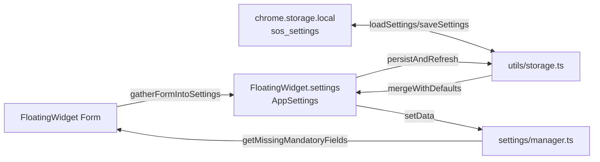

# SOS Logic Pathway

> Auto job application browser extension for LinkedIn and Indeed.
> Built with [WXT](https://wxt.dev/) (manifest V3, content scripts + background service worker).

**Version:** 1.0
**Last Updated:** 2026-05-01
**Maintainer:** SOS Team

---

## Table of Contents

1. [Architecture Overview](#1-architecture-overview)
2. [File Map](#2-file-map)
3. [Data Flow](#3-data-flow)
4. [Site Detection & Widget Initialization](#4-site-detection--widget-initialization)
5. [LinkedIn Pipeline (DOM-based)](#5-linkedin-pipeline-dom-based)
6. [Indeed / Legacy Pipeline (URL-based)](#6-indeed--legacy-pipeline-url-based)
7. [Settings System](#7-settings-system)
8. [Widget State Machine](#8-widget-state-machine)
9. [Job Validation](#9-job-validation)
10. [Filter Application](#10-filter-application)
11. [DOM Utilities](#11-dom-utilities)
12. [URL Parameter Glossary](#12-url-parameter-glossary)

---

## 1. Architecture Overview

```
  Browser Extension (WXT)

   background.ts ------> content.ts
   (service worker) msg    |  FloatingWidget (Shadow DOM)
                           |  pipeline/index.ts (dispatcher)
                           |    |
                           |    +-- linkedin.ts  OR  indeed.ts
                           |    +-- job-validator.ts (pure functions)
                           |
   chrome.storage.local
     - sos_settings   (AppSettings)
     - sos_pipeline   (PipelineState for Indeed)
     - sos_state_*    (SitePipelineState per site)
```

### Key Design Decisions

- **Two pipeline architectures:** LinkedIn uses a DOM-based SPA-compatible pipeline (no page reloads). Indeed uses a legacy URL-parameter-based pipeline (page reloads between steps).
- **Shadow DOM UI:** The FloatingWidget is isolated from the host page via `attachShadow({mode: "closed"})`.
- **State machine:** Widget has 10 states with explicit allowed transitions. Invalid transitions are logged and rejected.
- **Pure validation functions:** `job-validator.ts` is a collection of pure functions with no DOM or storage dependencies.
- **Settings cache:** In-memory cache in `utils/storage.ts` avoids `chrome.storage` round-trips on every page load.

---

## 2. File Map

```
sos/
wxt.config.ts              # WXT extension config (manifest V3)
tsconfig.json              # TypeScript configuration
package.json               # Dependencies
ROADMAP.md                 # Future plans
docs/
  state-machine.md         # Widget state machine doc
  logic-pathway.md         # THIS FILE
src/
  config/
    sites.ts               # SitePreset definitions (LinkedIn, Indeed)
  entrypoints/
    background.ts          # Service worker: site detection, tab monitoring
    content.ts             # Content script: widget creation, pipeline orchestration
  pipeline/
    index.ts               # Orchestrator: dispatches to site-specific pipelines
    types.ts               # Shared types: ApplyFiltersResult, JobListingData, JobPreview
    linkedin.ts            # LinkedIn DOM-based pipeline (661 lines)
    linkedin-constants.ts  # LinkedIn selectors, URL param maps
    indeed.ts              # Indeed URL-based pipeline (126 lines)
    job-validator.ts       # Pure functions for job validation
    filter-applier.ts      # DEPRECATED
  settings/
    base.ts                # Generic SettingsSection class
    sections.ts            # 8 settings sections with types + defaults
    manager.ts             # SettingsManager: I/O, validation, mandatory field checks
  types/
    site.ts                # SitePreset interface
    ui.ts                  # SiteWidgetState + FloatingWidgetOptions + SitePipelineState
    styles.d.ts            # CSS module declaration
  utils/
    dom.ts                 # DOM helpers: waitForElement, scrollAndClick, pushStateNavigate, etc.
    storage.ts             # chrome.storage wrapper with caching + merge-with-defaults
    ui.ts                  # FloatingWidget class (1090 lines) -- full widget implementation
  styles/
    ui.css                 # Widget styles (imported as raw string via ?raw)
```

---

## 3. Data Flow

### 3.1 Startup Flow

```
User navigates to linkedin.com/jobs/search/ or indeed.com/jobs?q=...

background.ts --tabs.onUpdated + 2s interval--> detect site via sitePresets
  |  matches?
  |  --yes--> browser.tabs.sendMessage("SOS_SITE_DETECTED", { presetId })
  |              |
  |              v
  |         content.ts --onMessage listener--> handleSiteDetected(presetId)
  |                                                |
  |                                          Determine initial state from:
  |                                            - onSearch results page?
  |                                            - missing mandatory fields?
  |                                                |
  |                                                v
  |                                        new FloatingWidget({...})
  |                                          creates Shadow DOM UI
  |                                          injects into page
  |
  +--no--> nothing (extension idle)
```

### 3.2 Content Script Self-Detection

On page load, `content.ts` also runs direct detection:

```
content.ts main()
  1. Check if URL has ?sos_running param -> runLegacyPipelineCycle()
  2. Else: find matching SitePreset by hostname
       -> handleSiteDetected(presetId)
  3. Set up URL change watcher (1s interval)
       On URL change -> reset widgetInitializedUrl -> re-run handleSiteDetected
```

### 3.3 User Clicks "Start"

```
User clicks Start on FloatingWidget
  -> FloatingWidget.handleToggle()
     - State = "nav"     -> call options.onNavigate()  [go to search page]
     - State = "idle"    -> persist + check missing fields
         - All filled  -> startPipeline()
         - Missing     -> setState("needsInfo") + showValidationErrors()
     - State = "running"  -> handleStop() -> options.onStop()
     - State = "ready"    -> startPipeline()
     - State = "error"    -> startPipeline()
```

### 3.4 Pipeline Dispatch (content.ts onToggle)

```
content.ts onToggle(true) callback (when Start clicked)
  |
  +-- presetId === "linkedin"
  |     - Load settings -> get linkedin site config
  |     - Create new AbortController
  |     - widget.setState("running")
  |     - await runLinkedInPipeline(site, signal, onProgress)
  |         - On success -> widget.setState("done")
  |     - On error:
  |         AbortError -> widget.setStopped()
  |         Other      -> widget.setError(msg)
  |
  +-- presetId !== "linkedin" (Indeed)
        - startLegacyPipeline(presetId)
            - Save PipelineState to chrome.storage
            - Save filters to chrome.storage
            - Set URL params: sos_term_idx, sos_max_jobs, sos_active, sos_running, keywords, location
            - window.location.href = new URL (page reload)
```

---

## 4. Site Detection & Widget Initialization

### 4.1 Background Script (`background.ts`)

**Role:** Detect when user visits a compatible job search page, notify the content script.

| Method | Trigger | Details |
|---|---|---|
| `tabs.onUpdated` | Page load / reload | Checks `loading` or `complete` status |
| `setInterval(2000)` | Every 2s on active tab | Catches SPA navigations not triggering `onUpdated` |

**Detection Logic (`notifyIfSearchPage`):**

```
notifyIfSearchPage(tabId, url)
  1. Parse URL
  2. Skip if URL has ?sos_running (SOS self-managing navigation)
  3. Find matching SitePreset by urlPattern
  4. Check if URL is a search page:
     - LinkedIn: url includes "/jobs/search/"
     - Indeed:   url includes "/jobs" AND has ?q= param
  5. If match -> browser.tabs.sendMessage("SOS_SITE_DETECTED", { presetId })
     (catch errors silently -- content script may not be injected yet)
```

### 4.2 Content Script (`content.ts`)

**Role:** Create the FloatingWidget, orchestrate pipelines, handle SPA navigation.

**State variables:**

| Variable | Purpose |
|---|---|
| `widget` | Singleton FloatingWidget instance |
| `widgetInitializedUrl` | Tracks last URL widget was initialized on (SPA guard) |
| `abortController` | AbortController for LinkedIn pipeline |

**`handleSiteDetected(presetId)` flow:**

```
1. Find preset by ID
2. SPA guard: skip if widgetInitializedUrl === current URL
3. Check if widget already exists in DOM:
   - YES -> reload settings, return
   - NO  -> continue
4. Determine initial state:
   - Not on search page -> "nav"
   - On search page, missing mandatory fields -> "idle"
   - On search page, all fields filled -> "ready"
5. Destroy old widget (if any orphaned reference)
6. Load settings
7. Create new FloatingWidget with callbacks:
   - onNavigate  -> navigateToSearchPage() (for LinkedIn)
   - onToggle    -> start LinkedIn pipeline OR startLegacyPipeline()
   - onStop      -> abortController.abort()
```

### 4.3 SPA Navigation Detection

```
content.ts watcher (1s interval)
  - Compares window.location.href to lastUrl
  - On change:
      - Update lastUrl
      - Reset widgetInitializedUrl = "" (allow re-init)
      - Find matching preset -> handleSiteDetected(presetId)
  - This handles LinkedIn SPA pushState navigations
```

---

## 5. LinkedIn Pipeline (DOM-based)

**File:** `src/pipeline/linkedin.ts`
**Strategy:** No page reloads. Uses DOM manipulation + `history.pushState` + `PopStateEvent`.

### 5.1 Pipeline Flow

```
runLinkedInPipeline(site, signal?, onProgress?)

  For each search term:

    Step A: navigateToSearchTerm(term)
      - Focus search input
      - Clear using setReactInputValue (React-aware setter)
      - Set new value using setReactInputValue
      - Dispatch KeyboardEvent("Enter") at native level
      - Wait for results container to re-render + extra 2s

    Step B: applyFiltersViaPushState(site)
      - Build filter URL from site settings (buildFilterUrl)
      - Push URL via history.pushState + PopStateEvent
        (LinkedIn React router listens for popstate)
      - Wait 2.5s for LinkedIn to re-fetch

    Step C: applyDomFilters(site, delay)
      - Open "All filters" modal (button click)
      - Toggle checkboxes: under10Applicants, inYourNetwork, fairChanceEmployer
      - Click "Show results"
      - Returns ApplyFiltersResult

    Step D: readAllJobPreviews(maxJobs)
      - Scroll list to trigger lazy loading
      - Wait for job cards via MutationObserver
      - Extract previews: title, company, location, url, element
      - Returns JobPreview[]

    Step E: filterJobPreviews(previews, site)
      - checkCompanyBadWords (with exception list)
      - checkTitleBadWords
      - Returns filtered JobPreview[]

    Step F: For each approved job
      - readJobDescription(job)
          Scroll + click the card
          Wait for detail panel
          Click "Show more" if available
          Scroll description container (lazy text loading)
          Extract visible text
          Returns { description, detailPanel }
      - validateFullJob(job, description, site)
          Calls validateJobForApplication() from job-validator.ts
      - If site.filters.pauseAfterFilters -> set paused state
        (TODO: wire into widget "resume" mechanism)
      - Delay 500ms between jobs

  Pipeline complete -> log + onProgress callback
```

### 5.2 Filter URL Building (`buildFilterUrl`)

```
buildFilterUrl(site)
  1. Start with current window.location.href
  2. Remove all previous SOS filter params: f_SB2, f_TPR, f_E, f_JT, f_WT, f_AL
  3. Set sort:  f_SB2 = 1 (recent) | 2 (relevant)
  4. Set date:  f_TPR = r86400 (24h) | r604800 (week) | r2592000 (month)
  5. Set exp:   f_E   = 1-6 comma-separated
  6. Set type:  f_JT  = F|P|C|T|V|I comma-separated
  7. Set onsite:f_WT  = 1|2|3 comma-separated
  8. Set easy:  f_AL  = true (if easyApplyOnly)
  9. Return URL (used for pushState)
```

### 5.3 Filter Application: URL vs DOM

| Filter Type | Method | Details |
|---|---|---|
| Sort, Date Posted, Experience, Job Type, On-site/Remote, Easy Apply | URL params (`pushState`) | `buildFilterUrl()` -> `pushStateNavigate()` |
| Under 10 Applicants, In Your Network, Fair Chance Employer | DOM (All Filters modal) | `applyDomFilters()` -- opens modal, toggles checkboxes |

### 5.4 Navigation to Search Page

```
navigateToSearchPage()
  - Guard: if already on /jobs/search/ -> return early
  - window.location.href = LINKEDIN_JOBS_SEARCH_URL (full page reload)
```

### 5.5 Easy Apply Modal

```
navigateToApply(detailPanel, signal?)
  - Find Easy Apply button (primary selector EASY_APPLY_BUTTON_SELECTOR)
  - Fallback: scan all buttons for "easy apply" / "apply now" / "apply"
  - If external apply link found -> window.location.href = external href (full redirect)
  - If no button found -> return null
  - Click button -> scrollAndClick
  - Wait for Easy Apply modal (EASY_APPLY_MODAL_SELECTOR, timeout 8s)
  - Return modal element (or null)
```

---

## 6. Indeed / Legacy Pipeline (URL-based)

**Files:** `src/pipeline/indeed.ts` + `content.ts` (legacy cycle functions)

### 6.1 Architecture

Unlike LinkedIn, the Indeed pipeline uses **page reloads** as navigation. State is persisted via URL parameters and `chrome.storage.local`.

```
startLegacyPipeline(presetId)
  - Load settings
  - Create PipelineState: { running, terms, location, currentIdx, maxJobs }
  - Save PipelineState to chrome.storage.local key "sos_pipeline"
  - Save filters to chrome.storage.local key "sos_filters_<presetId>"
  - Set URL params and reload:
      ?sos_term_idx=0&sos_max_jobs=30&sos_active=1&sos_running=1&keywords=...&location=...
      -> window.location.href = new URL (PAGE RELOAD)

Page reloads -> content.ts re-executes
  - Detects ?sos_running param -> runLegacyPipelineCycle()

runLegacyPipelineCycle()
  - Verify we're on a search results page
  - Load PipelineState from chrome.storage
  - Create/recreate FloatingWidget with "running" state
  - applyPostNavFilters(presetId) -> applyIndeedExtraFilters(site)
      - Open filter modal ("Filter" or "All filters" button)
      - Toggle checkboxes: Easy Apply, Under 10 Applicants, etc.
      - Click "Show results" / "Apply"
  - Clean up URL params (remove sos_* from URL)
  - captureJobs(presetId, maxJobs) -- currently returns empty for Indeed
  - Advance or complete
      - currentIdx++ -> if exhausted -> mark complete
      - Else: save state + navigate to next term (PAGE RELOAD)
        ?keywords=<next_term>&sos_term_idx=<n>&...&sos_running=1
```

### 6.2 Indeed Search URL Building

```
buildIndeedSearchUrl(site)
  - q=searchTerms (space-joined)
  - l=searchLocation
  - sort=date|relevance
  - fromage=1|7|14|30 (day ranges)
  - jt=fulltime,parttime,contract,temporary,internship (comma-separated)
  - Returns https://www.indeed.com/jobs\?\<params\>
```

---

## 7. Settings System

### 7.1 Settings Hierarchy

```
AppSettings
  global             (shared across all sites)
    personal         PersonalSettings  -- firstName, lastName, phone, city, street, state, zip, country
    eeo              EeoSettings       -- ethnicity, gender, disabilityStatus, veteranStatus
    globalBehavior   GlobalBehaviorSettings -- clickGap, smoothScroll, keepScreenAwake
  perSite            Record<string, SiteSettings>
    search           SearchSettings     -- searchTerms[], searchLocation, switchNumber, randomizeSearchOrder
    filters          FilterSettings     -- sortBy, datePosted, easyApplyOnly, experienceLevel[],
                                          jobType[], onSite[], companies[], badWords[], etc.
    answers          AnswerSettings     -- yearsOfExperience, requireVisa, linkedIn, desiredSalary, etc.
    pipeline         PipelineSettings   -- pauseBeforeSubmit, pauseAtFailedQuestion, runNonStop, etc.
    additional       AdditionalSettings -- autoFillScreeningQuestions, customAnswers{}, resumeData, resumeFileName
```

### 7.2 Storage Layer (`utils/storage.ts`)

| Function | Purpose |
|---|---|
| `loadSettings()` | Load from `chrome.storage.local["sos_settings"]`, merge with defaults, cache in memory |
| `saveSettings(settings)` | Save to storage + update in-memory cache |
| `invalidateSettingsCache()` | Clear cache (force next load to hit storage) |
| `onSettingsChanged(cb)` | Subscribe to storage changes (returns unsubscribe fn) |

**Merge strategy:** `mergeWithDefaults()` deep-merges partial saved data with full defaults:
- `global.personal`, `.eeo`, `.globalBehavior`: shallow spread merge
- `perSite`: foreach site, merge `search`, `filters`, `answers`, `pipeline`, `additional` with defaults

### 7.3 SettingsManager (`settings/manager.ts`)

| Method | Purpose |
|---|---|
| `load()` | Load from storage + ensure shape (fill missing sections) |
| `setData(data)` | Direct sync without storage round-trip |
| `save()` | Ensure shape + persist |
| `getSite(siteId)` | Get site settings (auto-initialize with defaults) |
| `validateAll()` | Validate all sections, return errors |
| `isSiteReady(siteId)` | Check if all mandatory fields filled |
| `getMissingMandatoryFields(siteId)` | List all empty mandatory fields |

**Mandatory fields** (pipeline will not start until all filled):

| Section | Fields |
|---|---|
| personal | firstName, lastName, phoneNumber, currentCity, street, state, zipcode, country |
| search | searchTerms (>=1), searchLocation, switchNumber (>0) |
| filters | sortBy, datePosted, currentExperience (>=0) |
| answers | requireVisa, yearsOfExperience, linkedIn, usCitizenship, desiredSalary (>0) |
| pipeline | clickGap (>0) |
| additional | resumeFileName (non-empty) |

### 7.4 Settings Sections (`settings/sections.ts`)

8 settings sections, each extending `SettingsSection<T>` from `base.ts`:

| Section | Type | Key Settings |
|---|---|---|
| `PersonalSection` | Global | Name, phone, address |
| `EeoSection` | Global | Ethnicity, gender, disability, veteran |
| `GlobalBehaviorSection` | Global | clickGap (1s default), smoothScroll, keepScreenAwake |
| `SearchSection` | Per-site | Search terms, location, switch #, randomize |
| `FilterSection` | Per-site | Sort, date, experience/title/company filters, bad words |
| `AnswerSection` | Per-site | Salary, visa, citizenship, cover letter, etc. |
| `PipelineSection` | Per-site | Pause flags, close tabs, run in background, etc. |
| `AdditionalSection` | Per-site | Auto-fill screening, custom Q&A, resume upload |

---

## 8. Widget State Machine

**File:** `src/utils/ui.ts` (FloatingWidget class, ~1090 lines)

### 8.1 State Visual

```
idle (grey) -> needsInfo (grey) -> ready (green) -> starting (blue) -> running (orange)
  |                                 |                                  |
  |                                 |                                  +-> paused (yellow)
  |                                 |                                  |-> done (green)
  |                                 |                                  |-> error (red)
  |                                 |                                  +-> stopped (red)
  |                                 |
  |                                 +-> error (red)
  |
  +-> nav (blue) -> ready (green)
```

### 8.2 Allowed Transitions

```
idle      -> nav, ready, needsInfo, running, starting, paused
needsInfo -> ready, idle, nav
nav       -> idle, ready
ready     -> starting, needsInfo, idle, nav
starting  -> running, error, stopped
running   -> paused, done, error, stopped
paused    -> running, stopped
stopped   -> ready, nav
done      -> ready, nav
error     -> ready, starting, nav
```

### 8.3 State Behaviors

| State | Toggle Button | Nav Button | Progress | Pause Ctrl | Error Banner |
|---|---|---|---|---|---|
| `idle` | Disabled, "Start" | Hidden | Hidden | Hidden | Hidden |
| `needsInfo` | Disabled, "Start" | Hidden | Hidden | Hidden | Hidden |
| `nav` | Hidden | Visible | Hidden | Hidden | Hidden |
| `ready` | Enabled, "Start" | Hidden | Hidden | Hidden | Hidden |
| `starting` | Disabled, "Starting" | Hidden | Visible | Hidden | Hidden |
| `running` | Enabled, "Running" | Hidden | Visible | Hidden | Hidden |
| `paused` | Disabled, "Paused" | Hidden | Hidden | Visible | Hidden |
| `stopped` | Disabled, "Stopped" | Hidden | Hidden | Hidden | Hidden |
| `done` | Disabled, "Done" | Hidden | Hidden | Hidden | Hidden |
| `error` | Enabled, "Error" | Hidden | Hidden | Hidden | Visible |

### 8.4 State Persistence

State is persisted under key `sos_state_<siteId>` in `chrome.storage.local`.

```
SitePipelineState {
  state: SiteWidgetState
  lastUpdated: number (timestamp)
  progress?: {
    currentTerm, currentTermIndex, totalTerms, processedJobs, approvedJobs
  }
  error?: string
}
```

On widget initialization, persisted state is restored (except "starting", "running", "paused" -- these are transient).

### 8.5 Auto-Transitions

- `stopped` -> `ready` after 1.5s timeout (allows user to see "Stopped" briefly, then re-enable Start)
- `done` / `error` -> user must click to transition back to `ready` or `starting`

---

## 9. Job Validation

**File:** `src/pipeline/job-validator.ts`
**Design:** Pure functions, no side effects, no DOM/storage dependencies.

### 9.1 Validation Pipeline

```
validateJobForApplication(company, title, description, filters)
  |
  +-- checkCompanyBadWords(company, badWords, goodWords)
  |     - If no bad words configured -> return true
  |     - Check good word exceptions first (if any match -> true)
  |     - Check if company contains any bad word -> true (pass) | false (filtered)
  |
  +-- checkTitleBadWords(title, badWords)
  |     - Check if title contains any bad word (case-insensitive)
  |
  +-- checkDescriptionBadWords(description, badWords)
  |     - Same pattern as title check
  |
  +-- checkSecurityClearance(description, hasClearance)
  |     - If hasClearance -> return true (all jobs pass)
  |     - If not -> check for "polygraph", "clearance", "secret" keywords
  |
  +-- checkExperienceRequirement(description, currentExperience, didMasters)
        - If currentExperience < 0 (unset) -> return true
        - Extract max years from description using regex
          Patterns: "3+ years", "5 years", "3-5 years", "2 to 4 years", "(5) years"
        - If no requirement extractable (0) -> return true
        - If didMasters + description contains "master" -> boost by 2 years
        - effectiveExperience >= required -> true | false
```

### 9.2 Filter Execution Order (LinkedIn Pipeline)

```
Pre-screen (card preview, no description needed):
  - checkCompanyBadWords  (company name)
  - checkTitleBadWords    (job title)

Deep validation (after reading full description):
  - checkDescriptionBadWords
  - checkSecurityClearance
  - checkExperienceRequirement
```

---

## 10. Filter Application

### 10.1 URL-Based Filters

Applied via `pushStateNavigate()` which:
1. Saves scroll position of the job list sidebar
2. Calls `history.pushState(scrollData, "", url)`
3. Dispatches `new PopStateEvent("popstate", { state: scrollData })`
4. LinkedIn React router intercepts `popstate`, re-fetches search results with new URL params

### 10.2 DOM-Based Toggles

Applied via `toggleCheckboxItems(modalContainer, items, delay)`:
1. Find label/span/div elements in the modal by text content
2. Click each enabled item
3. Wait `clickDelayMs` between clicks
4. Then click "Show results" / "Apply" button

---

## 11. DOM Utilities

**File:** `src/utils/dom.ts`

| Function | Purpose |
|---|---|
| `waitForElement(selector, timeout)` | Poll with MutationObserver, resolve when element appears or timeout |
| `clickElement(el)` | Type-safe HTMLElement click |
| `fillInput(selector, value)` | Set value + dispatch `input` + `change` events |
| `delay(ms)` | Promise-based setTimeout |
| `findElementByText(text, tag, container)` | Find element by exact text content (case-insensitive) |
| `scrollAndClick(el)` | Scroll into view (smooth, center) then click |
| `toggleCheckboxItems(container, items, delay)` | Generic checkbox toggler by text match |
| `findButtonByText(container, ...texts)` | Find button by partial text match |
| `scrollToBottom(el, attempts, interval)` | Repeatedly scroll to bottom until content stops growing |
| `getVisibleText(el)` | Clone element, remove hidden nodes, return text |
| `hasUrlParam(name)` | Check if URL has a query param |
| `removeUrlParam(name)` | Remove query param from URL |
| `pushStateNavigate(url)` | SPA navigation via pushState + PopStateEvent (saves scroll position) |
| `setReactInputValue(input, value)` | Set input value using native property setter (bypasses React synthetic events) |

---

## 12. URL Parameter Glossary

### 12.1 SOS Pipeline Parameters (for non-LinkedIn sites)

| Param | Purpose |
|---|---|
| `sos_running` | Flag indicating SOS pipeline is active (suppresses background detection) |
| `sos_term_idx` | Current search term index |
| `sos_max_jobs` | Max jobs to process per term |
| `sos_active` | Pipeline active flag |

### 12.2 LinkedIn Filter URL Parameters

| Param | Values | Meaning |
|---|---|---|
| `f_SB2` | `1` / `2` | Most recent / Most relevant |
| `f_TPR` | `r86400` / `r604800` / `r2592000` | Past 24h / Week / Month |
| `f_E` | `1,2,3,4,5,6` | Internship, Entry, Associate, Mid-Senior, Director, Executive |
| `f_JT` | `F,P,C,T,V,I` | Full-time, Part-time, Contract, Temporary, Volunteer, Internship |
| `f_WT` | `1,2,3` | On-site, Remote, Hybrid |
| `f_AL` | `true` | Easy Apply only |

### 12.3 Indeed Filter URL Parameters

| Param | Values | Meaning |
|---|---|---|
| `q` | Search terms | Keywords |
| `l` | Location | Search location |
| `sort` | `date` / `relevance` | Sort order |
| `fromage` | `1,7,14,30` | Past 24h / Week / 14 days / Month |
| `jt` | `fulltime,parttime,...` | Job type |

---

## Appendix A: Key Module Dependencies

```
content.ts
  +-- config/sites.ts          (sitePresets)
  +-- utils/ui.ts              (FloatingWidget)
  +-- settings/manager.ts      (settingsManager)
  +-- settings/sections.ts     (AppSettings types)
  +-- utils/storage.ts         (loadSettings)
  +-- pipeline/index.ts        (isOnSearchResultsPage, applyPostNavFilters, captureJobs)
  +-- pipeline/linkedin.ts     (runLinkedInPipeline, navigateToSearchPage)

utils/ui.ts (FloatingWidget)
  +-- types/ui.ts              (FloatingWidgetOptions, SiteWidgetState, SitePipelineState)
  +-- settings/sections.ts     (AppSettings, GlobalSettings, SiteSettings, DEFAULT_SITE)
  +-- settings/manager.ts      (settingsManager)
  +-- utils/storage.ts         (loadSettings, saveSettings)
  +-- styles/ui.css?raw        (Shadow DOM styles)

pipeline/linkedin.ts
  +-- settings/sections.ts     (SiteSettings)
  +-- pipeline/types.ts        (ApplyFiltersResult, JobPreview, JobListingData)
  +-- pipeline/job-validator.ts (checkCompanyBadWords, checkTitleBadWords, validateJobForApplication)
  +-- pipeline/linkedin-constants.ts (all selectors + URL param maps)
  +-- utils/dom.ts             (all DOM helpers)

settings/manager.ts
  +-- settings/sections.ts     (all section classes, types, defaults)
  +-- utils/storage.ts         (loadSettings, saveSettings)

utils/storage.ts
  +-- settings/sections.ts     (AppSettings, GlobalSettings, SiteSettings, defaults)
  +-- wxt/browser              (browser.storage.local)
```

## Appendix B: Pipeline Comparison

| Aspect | LinkedIn | Indeed / Legacy |
|---|---|---|
| Navigation | DOM manipulation + pushState | URL params + page reload |
| State persistence | In-memory (AbortController for stop) | chrome.storage.local + URL params |
| Content script | Continuous (same context) | Re-initializes on each page load |
| Pipeline type | Single async function | Cycle-based (run -> reload -> re-detect -> run) |
| Job reading | DOM (scroll list, wait for cards, read detail panel) | `captureJobs()` -- currently not implemented |
| Filter application | URL params (pushState) + DOM modal toggles | `applyIndeedExtraFilters()` -- DOM modal toggles |
| SPA support | Full support (pushState watcher, PopStateEvent) | N/A (full page reloads) |
| Stop mechanism | AbortController.abort() | Widget state management (pipeline runs until URL params removed) |

## Appendix C: Mermaid Diagrams

You can paste the following into a Mermaid-compatible Markdown renderer or VS Code extension for visual diagrams.

### LinkedIn Pipeline



### Indeed Legacy Pipeline



### Widget State Machine



### Settings Data Flow


